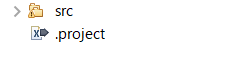
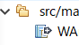

## svn更新の際に競合が発生した場合
### 競合が起きたファイルの確認方法
1. パッケージエクスプローラの更新したプロジェクト上で右クリック→「チーム」→「リポジトリと同期化」
2. チーム同期化ビューが開くので競合したファイル(赤いマークの付いたもの)が確認できる
3. 競合ファイル上で右クリック→「比較エディタで開く」で実際に競合した個所を確認できる

下図のようにファイルのマークが黒の右矢印になっているファイルは競合していない  

### 競合の解決方法
#### ①ローカルの変更をなくしてリポジトリの内容を上書きする場合
1. 対象のファイルの上で右クリック→「オーバーライドおよび更新」  
   ⇒リポジトリの状態に上書きされる

**※間違えて「オーバーライドおよびコミット」を選ばないように！**  

下図のようにファイルのマークが黒の右矢印になっていれば競合が解決している  

#### ②ローカルの変更を残したい場合
1. 影響が他の編集者にも影響するので、上長等を読んで対応してもらう。
