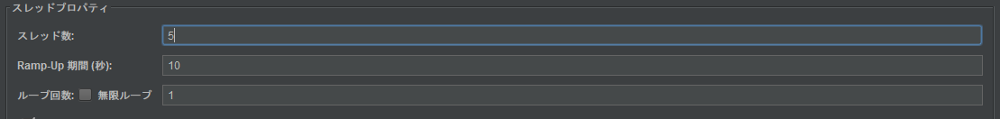

# JMeterを使った負荷試験
負荷試験において試験したいシナリオを「◯秒間に◯回の頻度で◯回(もしくは◯時間)実行したい」ということがある。
JMeterではこれを実現する方法として主に以下の2つの方法がある。

1. [スレッドグループのスレッドプロパティ設定](#スレッドグループのスレッドプロパティ設定を利用する方法)
2. [定数スループットタイマ](#定数スループットタイマを利用する方法)

どちらの方法でも一定頻度でのシナリオの実行が可能だが、両者の使い方や役割の違いを調べてみた。

## スレッドグループのスレッドプロパティ設定を利用する方法
### 設定方法

例えば以下のように設定した場合、「5スレッドを10秒の時間をかけて処理開始し、スレッドごとにシナリオを1回だけ実行する」という意味になる。

スレッドの実行間隔は`Ramp-Up期間(10秒) ÷ スレッド数(5)`で2秒となる。  

### 問題点

上記のような少ないスレッド数であれば問題ないが、負荷試験のような大量のリクエストを実行する場合には問題が生じる。  
例えば以下のように設定すると、うまく動かない。

この原因は、JMeterは**Ramp-Up期間の設定によらず、テスト開始直後に指定されたスレッド数分のスレッドを一度に作成している**ことにある。そのため、テスト開始時に大量のスレッドが一気に起動しCPUメモリが圧迫されてしまう。  
負荷試験なのでサーバに負荷がかかるのは意図通りだが、クライアント側に負荷がかかってテストがストップしてしまうのである。

公式のマニュアルにも「Ramp-Up期間は、(同時にリクエストが流れることによる)テスト開始時の過剰な負荷を避けることができるように設定する必要がある」と記載されており、ユーザの手でこのような事態を回避する必要がある。

### Ramp-Up期間の役割

そもそもRamp-Up期間は「リクエストの実行頻度を制御する」ためのものではない。  
公式によると**Ramp-Up期間の指定は「スレッドのスタートと実行をずらす」ため**であると記載されている。

「Ramp up」の意味は「立ち上げ」であり、Ramp-Up期間で指定した時間が意味するのは**「負荷試験のために複数スレッドを並列実行したいけど、クライアント側の負荷を下げるために指定した時間内での実行タイミングのずれを許容します。」**ということなのだと思う。

### 回避方法

以下のような方法でメモリ負荷上昇を回避可能。  
しかし、この方法をとった場合のJMeter側の処理限界は150rps程度なので、負荷がかかりすぎないよういちいちループ回数を調整するのは非効率である。  
多量のリクエストを流したい場合、Ramp-Up期間の本来の役割を考えると、後述する定数スループットタイマを使う方が望ましい。

1. スレッド数、Ramp-Up期間ではなく、ループ回数を増やす

2. 「Delay Thread creation until needed」のオプションを有効にする
	※バージョン2.8以降

## 定数スループットタイマを利用する方法

スループットタイマには

- 定数スループットタイマ
- スループットシェイピングタイマ

の2種類が存在するが、後者は割愛する。参考URLを参照。

### 設定方法

動かしたいサンプル数をターゲットスループット(サンプル数/分)にセットする。  
(ここでは1サンプル=1リクエストだと思ってもらえればOK。)

例えば10秒ごとに5回サンプラーを実行したい場合は1分(=60秒)で30回なので、以下のように設定する。

こうするとサンプラーの実行が1分ごとに30件までに制限され、実行間隔も60秒÷サンプラー数(30件)で2秒おきとなる。

スレッドプロパティで以下のように1秒ごとに1スレッド実行(1分に60スレッド)するよう設定したとしても、1分間にサンプラー30件までが守られる。

定数スループットタイマはあくまでサンプラーの実行頻度を制御するものであるので、定数スループットタイマでサンプラーの実行頻度を設定したとしても、同じ処理を繰り返し実行して一定時間負荷をかけたい場合などには、併せてスレッドグループのスレッドプロパティを設定する必要がある。

## 使い分け

両者の使い分けとしては以下のようなイメージ。

- スレッドグループのスレッドプロパティ  
	⇒リクエスト数件程度の軽いテストに使用
- 定数スループットタイマ  
	⇒大量のリクエストを制御する負荷テストに使用

# 参考
JMeter の利用方法(1) – Ramp－up、スレッド数、ループ回数の誤用  
https://keis-software.com/2013/09/02/jmeter-%E3%81%AE%E5%88%A9%E7%94%A8%E6%96%B9%E6%B3%951-ramp%EF%BC%8Dup%E3%80%81%E3%82%B9%E3%83%AC%E3%83%83%E3%83%89%E6%95%B0%E3%80%81%E3%83%AB%E3%83%BC%E3%83%97%E5%9B%9E%E6%95%B0%E3%81%AE%E8%AA%A4/

JMeter の利用方法(4) – タイマによるスループットの制限方法  
https://keis-software.com/2013/11/11/jmeter-%E3%81%AE%E5%88%A9%E7%94%A8%E6%96%B9%E6%B3%954-%E3%82%BF%E3%82%A4%E3%83%9E%E3%81%AB%E3%82%88%E3%82%8B%E3%82%B9%E3%83%AB%E3%83%BC%E3%83%97%E3%83%83%E3%83%88%E3%81%AE%E5%88%B6/
