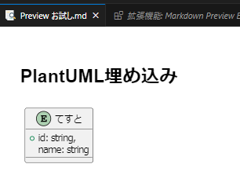

# やりたいこと
- mdファイル内にPlantUMLで作った図を埋め込みたい。
- 画像ファイルとして埋め込むのではなく、ソースコードを埋め込んでプレビューで見れるようにしたい。
- まずはVSCode上のプレビューで見れるようにしたい。
- さらにGitHub上でも描画できるとなおよい。

# 進捗
VSCodeプレビューがうまくいかない...

# やったこと
## まずは単にmdファイルを作ってみる

```md
## PlantUML埋め込み
\```plantuml
@startuml おためし

entity てすと {
    +id: string,
    name: string
}

@enduml
\```
```

プレビューしてみると...

  
なんかエラーが出る。  　

ちなみにPlantUML単品でのプレビューだとこうなる。

  
  
## Jarファイルのパス指定
参考URLをもとにプレビュー画像を描画するJARファイルをパスを設定する。  

拡張機能「Markdown Preview Enhanced」の設定を開く。


「Markdown-preview-enhanced: Plantuml Jar Path」の設定に  
VSCode拡張機能でインストールしたPlantUMLのJARファイルパス  
「/Users/【ユーザ名】/..../plantuml.jar」を設定する。


改めてmdファイルのプレビューを開いてみると...

  
変わらねえじゃねえか。  
というか「PlantUMLサーバがありません。」って表示の時点で  
JARファイルじゃなくてリモートサーバのURL見に行こうとしてるよね。

# 参考
【2023年版】VSCodeでPlantUMLを単独・MarkDown埋め込みの両方で使えるようにする  
https://zenn.dev/gahuto/articles/tkt-vscode-plantuml

VSCodeでMarkDownとPlantUMLを使う  
https://zenn.dev/yuhati/articles/880396ce89e38e