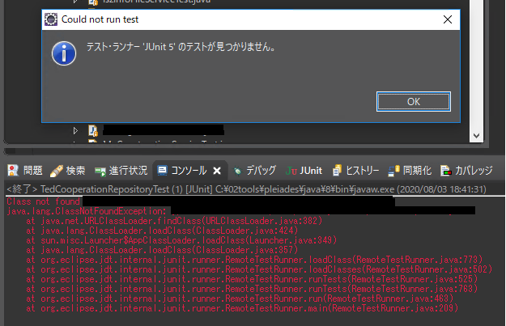

## はじめに
eclispeで新規作成したJUnitクラスを実行しようとしたところ、下記のようなエラーが発生してめちゃくちゃ詰まったのでわかったことを備忘録として記述しておく。



## ClassNotFoundExceptionとは
その名の通りクラスが参照しようとしたクラスが見つからないときに発生する例外。ここでいう”クラス”とは **.classファイル**のことであり、**見つからなかったクラスの.javaファイルがコンパイルできてない**ことを指す。

## 本エラーの発生要因
eclipseは保存時(Ctrl + S 押下時)に自動でコンパイルを行い、.classファイルを生成している。しかし、.classファイルの保存場所に以前のコンパイル時の残骸が残っていると、自動コンパイルがうまくいかずに.classファイルが更新されないことがある。

一度作成したJavaファイルのクラス名を変更すると発生することがあるみたい。

## 解決方法
1. プロジェクト内の.classファイルを全削除(.classファイルはtargetフォルダ以下にすべて配置されている、たぶん)
```
> cd [プロジェクト内targetフォルダ]
> del /s *.class
```

2. eclipseを再起動し、JUnit再実行する

## 参考

java.lang.ClassNotFoundException って、どういうことよ？  
https://ts0818.hatenablog.com/entry/2019/08/23/165818
