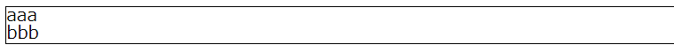
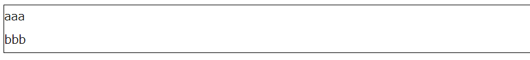
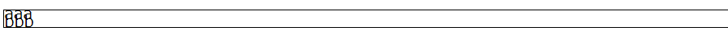
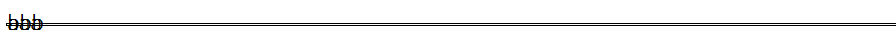

## はじめに
cssのプロパティにline-heightというのがある。
こいつの存在をないがしろにしてると予期せぬ余白を生んでしまうことがある大事なプロパティ。  
なんとなく行間を設定しているのかなと思ってたけど違った。  
だって「行間」は英語で「line spacing」だから。では「line height」ってなんだ？  
実は深く考える必要はなくて読んで字のごとくline-heightは **「行の高さ」を設定するプロパティ**なのである。  
てか、調べたら普通に書いてある。勝手にそうだと思い込むとまずいね。  

## line-heightの意味
line-heightは **「行の高さ」** を意味する。

1. たとえば　line-height: 1px; と設定すると、「1行が占有する領域の高さは 1px」となる。
   仮にテキストの文字の高さが1pxだとすると、  
   **文字の高さ = 行の高さ** であるから、行間のない詰まったような表示になる。
   
   
   
   ※ちなみに`line-height: 1em;`(emはなくてもよい)と設定すると文字の高さを1としたときの行の高さを設定できる。  

  

2. 次に文字の高さ1pxに対してline-height: 2px;とすると、

   **文字の高さ < 行の高さ**であるから、文字の上下に0.5pxずつ(行間は0.5+0.5=1px)の**余白が作られる**。
   

3. 文字の高さ2pxに対してline-height: 1px;とすると
   **文字の高さ > 行の高さ**であるから、各行の文字が1pxの高さに収まろうとするので、
   各行の文字同士が1pxずつ**重なって表示**される。
   
   
   
   もちろん、line-height: 0px;にすれば各行が完全に重なることになる。
   
   
