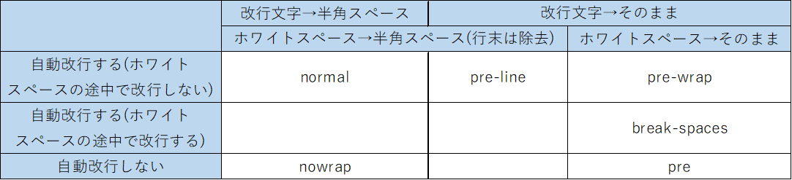

# はじめに
そもそも特にプロパティを設定しなくてもブロック要素内では、
テキストは自動で改行されるようになっている。  
というのもデフォルト状態だと各言語の慣習に基づいて改行される設定となっている。
- CJK(中国語,日本語,韓国語 ：単語がスペース区切りになってない言語)は単語の途中でも改行する
- 英数字は単語の途中では改行せず、自動改行する場合はスペースの位置で行う  
  (テキストが表示領域を超えてでも、単語の途中で改行されないことを絶対とする)
- 禁則処理(文章の読みやすさや美的観点から、句読点や括弧等が行頭・行末に来ないようにすること)は厳密に行う  

など。

テキストの改行に関して以下の観点が存在する。  
1. 自動改行するか
1. 空白文字(ホワイトスペース)をどう扱うか
1. 改行文字をどう扱うか
1. 表示領域の境界に到達した場合、単語の途中でも
改行するか
1. 1単語で表示領域を超える場合、単語の途中で改行するか

この観点の違いによって主に3種類の改行に関わるプロパティが存在する。

# 改行に関わるプロパティ
前述の通り、改行に関わるプロパティは主に3種類があり、
互いの関係としては以下の通り。

**white-space**: 自動改行するかどうか  
**word-break**: 自動改行する場合の設定①  
**overflow-wrap**: 自動改行する場合の設定②  

## white-spaceプロパティ

改行には
- 手動改行：改行文字による手動改行  
- 自動改行：テキストが親ブロック要素の表示領域をはみ出さないようにブラウザが行う改行  

の2種類がある。
white-spaceプロパティは**それぞれの改行をブラウザ上で表示するか否か**を設定することができる。  
また、このプロパティはその名の通り**ホワイトスペースをどう扱うか**も設定することができる。  
まとめるとwhite-spaceプロパティは大きく以下の2つの設定を行うことができるプロパティである。  
(プロパティ名が改行文字について言及できていないし、改行とホワイトスペースのプロパティ分けろよていうのが正直な感想。)

1. 改行の表示方法
1. ホワイトスペースの表示方法

さらに各値を見てみると、  
このプロパティは
1. 自動改行(改行文以外での改行)するか
1. ホワイトスペース(連続する半角スペース/タブ)をどう扱うか
1. 改行文字をどう扱うか  
の組み合わせによって値が用意されている。

各値を表にすると以下の通り。  

## word-break(旧line-break)プロパティ
line-breakプロパティはIEで独自採用されていたプロパティで、word-breakと名前を変えて標準採用された。
line-breakは自動改行時の**禁則処理をどれくらい厳密にするか**を設定するプロパティであった。
word-breakはその設定を受け継ぎつつ、値の種類を減らしてシンプルにした感じ。

前述の通りword-breakプロパティは自動改行する際の改行位置について設定ができる。    
そのため、このプロパティの値を設定する場合、**前提としてwhite-spaceプロパティの値が自動改行あり
(normal,pre-wrap,pre-line)に設定されている必要がある**。  

word-breakプロパティは**テキストが表示領域の端まで来たときに、単語の途中であろうと改行させるかどうか**を設定することができる。  
つまり、単語の切れ目とか気にせず、**表示領域内にテキストをできるだけキチキチに詰める**設定ができる。

各値と効果は以下のとおり。
| 値 | 効果 |
|:-:|:-:|
| normal | 【デフォルト値】各言語の慣習(禁則処理を守ること)を最優先する。 |
| keep-all | 単語の途中で改行が起きないことを最優先する。英数字はnormalと同じで、CJKは単語の途中(句読点やスペース、記号以外)では改行されない。 |
| break-all | テキストが表示領域からはみ出さないこと、できるだけキツキツにテキストを詰めることを最優先する。英数字は単語の途中でも表示領域の端に差しかかったら改行(ただし、句読点やスペースが行の先頭に来るのは避ける)し、CJKはnormalと同じ。 |
| break-word | 【非推奨：削除予定】 テキストが表示領域からはみ出さないことを守りつつ、できるだけ単語の途中で改行が起きないようにする。基本的にnormalと同じ動きをするが、単語の長さが表示領域を超える場合は単語の途中で改行して、テキストが表示領域を超えないようにする。|

## overflow-wrap(旧word-wrap)プロパティ
word-wrapはIEで独自採用されていたプロパティで、overflow-wrapと名前を変えて標準採用された。
その後も互換性のためにword-warpもそのまま残されており、overflow-wrapの短縮形のように使うことができる。

word-breakプロパティと同様に、**前提としてwhite-spaceプロパティの値が自動改行あり
(normal,pre-wrap,pre-line)に設定されている必要がある**。

overflow-wrapは**表示範囲に収まらない長い連続する文字列を、途中で改行させるかどうか**を設定することができる。
つまり、**できるだけ単語の区切りで改行するようにするけど、やむを得ない場合(表示範囲より単語が長い場合)は表示領域端で改行する**という設定ができる。

各値と効果は以下のとおり。
| 値 | 効果 |
|:-:|:-:|
| normal | 【デフォルト】各言語の慣習に従う。英数字は1単語で表示領域を超えたとしても単語の途中では改行しない。(改行可能文字(句読点やスペースなど)がないかぎり自動改行しない。) |
| break-word | 1単語で表示領域を超えた場合のみ、単語の単語の途中でも表示領域端で改行する。表示領域を超えたとしても改行可能文字があればその位置で改行し、表示領域を超えないようにする。 |
| anywhere | break-wordよりさらに禁則処理の優先度を下げたもの。テキストが表示領域を超える場合、単語だけでなく任意の位置での改行を許す。(結果的に禁則処理対象記号が行頭や行末に来る可能性がある。) |

## まとめ
上記3プロパティに共通するのは"自動改行"に関する設定ができるということ。  

そもそも自動改行するのかどうか  
　⇒white-space  

各言語の慣習を優先  
　⇒デフォルトの自動改行

表示領域にキチキチで詰め込むことを優先  
　⇒word-break: break-all;  

臨機応変型(表示領域内に収めることを保持しつつ、できるだけ各言語の慣習も守る)   
　⇒overflow-wrap: break-word;

## おまけ
上記の説明では省いた細かい内容について。(以下、Chromeブラウザのみを対象に話を展開する)  
基本的にover-flow: break-word; と word-break: break-all; さえあればいけそうと思えるかもしれないが、
実はこんな時に改行が効かないからほかにもプロパティ値があるんだよっていう話。  
詳しくは[こちら](https://qiita.com/akane_kato/items/2b1385574e1a1babdde1)。  
(本文外のコメントも参考になる)

表示領域を超える英単語や単語の途中での改行以外にも、表示領域外にはみ出てしまう可能性がある特殊な場合が存在する。まとめると以下の場合。

|  |  | デフォルト | word-break: break-all; | overflow-wrap: break-word; | overflow-wrap: anywhere; |
|:-:|:-:|:-:|:-:|:-:|:-:|
| 1 | 表示領域を超える長い英単語の途中で改行 | × | ○ | ○ | ○ |
| 2 | 禁則処理(対象の記号を行頭or行末にしない) | ○ | ○ | ○ | × |
| 3 | 禁則処理対象記号のかたまりの途中で改行（!!!!!!!!! など） | × | × | ○ | ○ |
| 4 | テーブルセル内でも適用されるか | - | ○ | × | ○ |

### word-break: break-all;  の禁則処理対象記号の扱い
"break-all"なのに改行できないてどういうこと！？て思いそうだが、
そもそも**②と③は矛盾している**のだから仕方がないとも言える。
例えば行頭禁則記号"!"や"。"は行頭に配置されることを避けたいためこれらの文字の直前で改行することはできない。
このように禁則処理を守ろうとすると必然的に「!!!!!!!!」のようなものは改行できない大きな塊となってしまう。

でも実はFirefoxの word-break: break-all; ではこのような問題は起きておらず、「!!!!!!!」も改行できてる。
このような違いが出ているのはそもそも**連続する禁則処理対象記号をどう扱うかがCSSで定義されていないから**らしい。
一番悪いのはCSSなのかも。

一方でoverflow-wrap: break-word; はこの問題を回避できているようだ。
(禁則処理を守った上でどうしても表示領域を超えてしまう場合は表示領域端で折り返しますよていうやつだから？)

### dispay:table-cell; では overflow-wrap: break-word; が適用されないことについて
実を言うと適用されていないわけではないと思う。
display: table-cell; を設定した場合、同時にtable-layout: auto; を設定したことになる。
table-layot: auto; は要素の幅を内容(テキスト)の幅に合わせるという設定である。
この設定によりdisplay: table-cell; を設定した要素は内容がはみ出ないサイズに設定されてしまうがために、
結果的にoverflow-wrapプロパティ(内容が表示領域をはみ出した場合の扱いを決めるプロパティ)が適用されるパターンになり得ないのである。

### overflow-wrap: anywhere; について
overflow-wrap: anywhere; はおそらく禁則処理の優先度が下がっており、他に改行可能箇所がなくテキストが表示領域をはみ出してしまう場合にのみ、
禁則処理を破って行頭禁足記号の「!」や「、」などを行頭になるような改行を行うようだ。(基本は禁則処理も守るが、表示領域に内容を収めることを優先する。)  
この禁則処理の緩和はtable-layout: auto;よりも優先適用されているようだ。

# 参考

overflow-wrap(word-wrap)とword-breakの違い  
https://www.google.co.jp/amp/s/web.hazu.jp/overflow-wrap-word-break/amp/

【CSS】テキストを折り返す方法  
https://creive.me/archives/17653/

overflow-wrap: break-word; や word-break: break; が万能の改行処理だったら、こんなに苦労していない
https://qiita.com/akane_kato/items/2b1385574e1a1babdde1

word-breakとword-wrapはややこしい  
https://w3g.jp/blog/confusing_word-break_word-wrap

white-space CSS クイックリファレンス  
http://www.htmq.com/style/white-space.shtml

white-space MDN web docs  
https://developer.mozilla.org/ja/docs/Web/CSS/white-space

line-break CSS クイックリファレンス  
http://www.htmq.com/style/line-break.shtml

overflow-wrap CSS クイックリファレンス  
http://www.htmq.com/css/overflow-wrap.shtml

word-wrap CSS クイックリファレンス  
http://www.htmq.com/css/word-wrap.shtml

