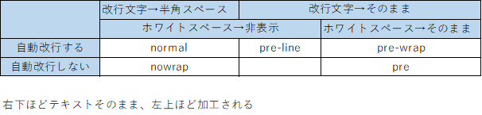

# はじめに
そもそも特にプロパティを設定しなくてもブロック要素内では、
テキストは自動で改行されるようになっている。  
というのもデフォルト状態だと各言語の慣習に基づいて改行される設定となっている。
- CJK(中国語,日本語,韓国語)は単語の途中でも改行する
- 英数字は単語の途中では改行せず、自動改行する場合はスペースの位置で行う  

など。

テキストの改行に関して以下の観点が存在する。  
1. 自動改行するか
1. 空白文字(ホワイトスペース)をどう扱うか
1. 改行文字をどう扱うか
1. 表示領域を端に到達した場合、単語の途中でも
改行するか
1. 1単語で表示領域を超える場合、単語の途中で改行するか

この観点の違いによって主に3種類の改行に関わるプロパティが存在する。

# 改行に関わるプロパティ
前述の通り、改行に関わるプロパティは主に3種類があり、
互いの関係としては以下の通り。

**white-space**: 自動改行するかどうか  
**word-break**: 自動改行する場合の設定①  
**overflow-wrap**: 自動改行する場合の設定②  

## white-spaceプロパティ

改行には**改行文字による手動改行**と**テキストが親ブロック要素の表示領域をはみ出さないようにブラウザが行う自動改行**の2種類がある。
white-spaceプロパティは**それぞれの改行をブラウザ上で表示するか否か**を設定することができる。  
また、このプロパティはその名の通りホワイトスペースを表示するか否かも設定することができる。  
まとめるとwhite-spaceプロパティは大きく以下の2つの設定を行うことができるプロパティである。  
(プロパティ名が改行文字について表現できていないし、改行とホワイトスペースのプロパティ分けろよていうのが正直な感想。)

1. 改行の表示方法
1. ホワイトスペースの表示方法

さらに各値を見てみると、  
このプロパティは
1. 自動改行(改行文以外での改行)するか
1. ホワイトスペース(連続する半角スペース/タブ)をどう扱うか
1. 改行文字をどう扱うか  
の組み合わせによって値が用意されている。

各値を表にすると以下の通り。  

## word-breakプロパティ
word-breakプロパティは自動改行する際の改行位置について設定ができる。    
そのため、このプロパティの値を設定する場合、**前提としてwhite-spaceプロパティの値が自動改行あり
(normal,pre-wrap,pre-line)に設定されている必要がある**。  
overflow-wrapプロパティとの差別化のためにさらに説明すると、
word-breakプロパティは**テキストが表示領域の端まで来たときに、単語の途中であろうと改行させるかどうか**を設定することができる。  

## overflow-wrap(word-wrap)プロパティ

# 参考
overflow-wrap(word-wrap)とword-breakの違い  
https://www.google.co.jp/amp/s/web.hazu.jp/overflow-wrap-word-break/amp/

white-space CSS クイックリファレンス  
http://www.htmq.com/style/white-space.shtml

