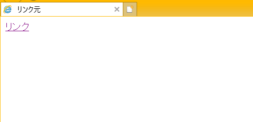
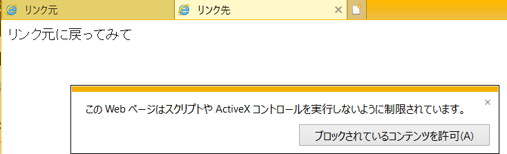
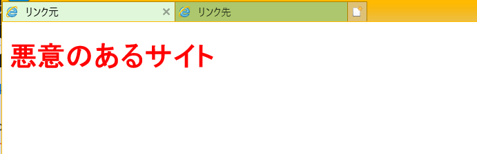

## aタグのリンクを新しいタブで開く方法
以下のように属性を設定すると実現できる。
```
<a href="[リンク先URL]" target="_blank">リンク</a>
```
## target="_blank"のセキュリティ問題
実は**target="_blank"で別タブで開いたリンク先とリンク元は同一のページとして扱われてしまう。**  
要は**リンク先からリンク元をいじることができてしまう**ということであり、
具体的には**リンク元のURLを書き換える**ことができる。
## 実際にやってみた

ソースはこちら。かなりシンプル。  
[リンク元URL書き換え](aタグで別タブで開く実装の脆弱性)

GoogleChromeなどではすでにセキュリティ対策されてるので、Internet Explorerで開いてみる。  


リンクをクリックすると別タブでリンク先が開く。  


さすがにInternet Explorerでもブロックされるようだ。  
「ブロックされているコンテンツを許可」をクリックしてからリンク元に戻ってみると..。  


こわっ。  
例えばもし書き換えられたURLがAmazonのログイン画面を偽造したサイトだったら、間違えてアカウントとパスワード入力してしまうかもしれない。この脆弱性はいわゆるフィッシング攻撃の手段として悪用されている。

## セキュリティ問題の回避方法
以下のように記述を追加してリンク元にアクセスできないようにする。
```
<a href="[リンク先URL]" target="_blank" rel="noopener noreferrer">リンク</a>
```
noopenerはWindows.opernerプロパティをnullに設定することで、リンク元の文書にアクセスできないようにする。  
noreferrerはWindows.opernerプロパティをnullに設定するとともに、そのほかのリンク元の情報をリンク先に送信しないようにしてくれる。  
noreferrerのほうが対応範囲が広いが、比較的新しい機能のため対応していないブラウザが多いので両方つけるのが望ましい。

ほとんどのブラウザではこのような対策がすでにされているみたい。

## 参考
実はヤバい？aタグと別タブで開く（target=”_blank”）の使い方　  
https://wwg.co.jp/blog/3807#an21

HTMLでリンクを別タブ・別ウィンドウで開く方法と、脆弱性に関する注意  
https://toragramming.com/web/html/html-link-target-blank/
