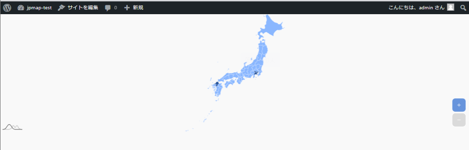
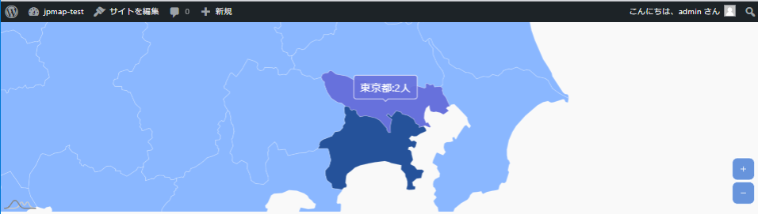

# プログラム概要
日本地図を表示し、都道府県別のユーザの有無に応じて色分けする。  
※ひとまず都道府県別のユーザ数はソースコード上でべた書き。

# ソースコード
※WordPress上で動かすためのソースコードであって、htmlファイルを単にブラウザで開いても動作しないので注意。

- [リソース](./amchartst_jpn.resources)
- [HTML](./amchartst_jpn.html)
- [JavaScript](./amchartst_jpn.js)

# キャプチャ画像
### 初期表示

### 都道府県の選択時

