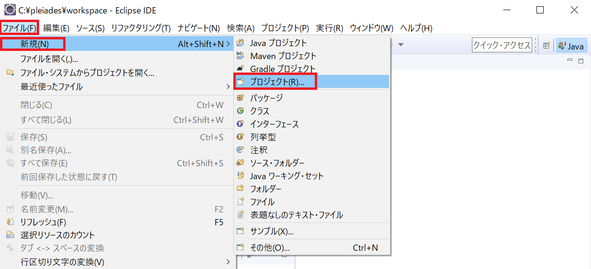
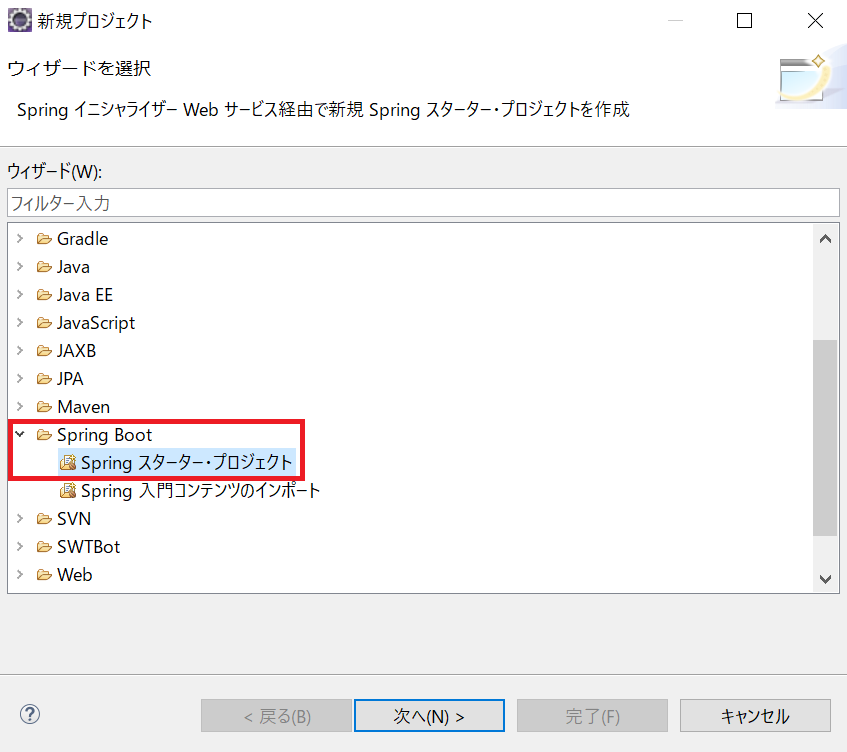
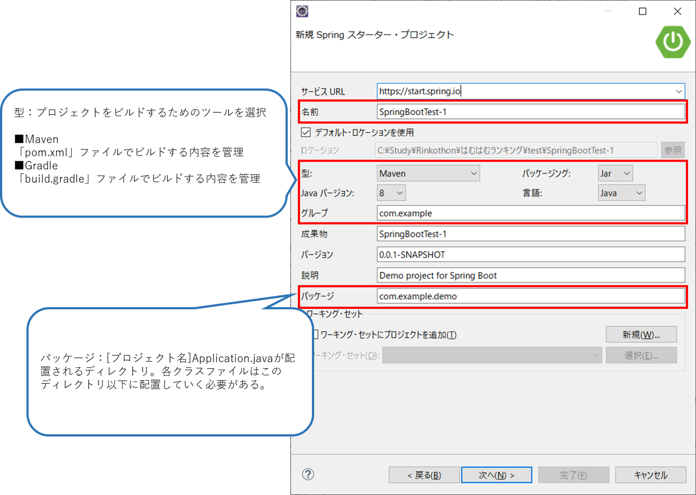
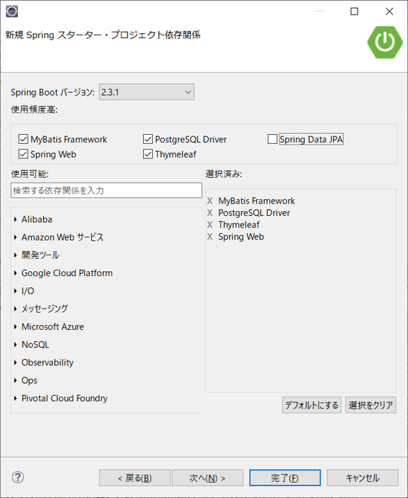
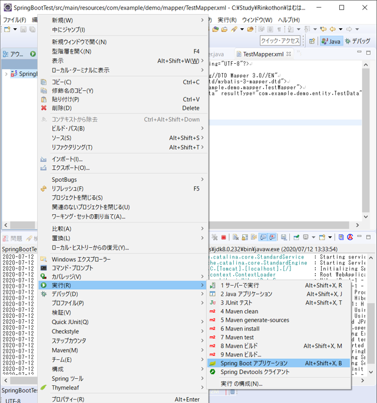

# Spring Boot 環境構築

よさげなページ見つけた

[https://medium-company.com/spring-boot%E7%92%B0%E5%A2%83%E6%A7%8B%E7%AF%89/](https://medium-company.com/spring-boot環境構築/)


## 前提として必要なもの

※Spring Boot 2.2.7.RELEASEの場合

- Java8 (Java14まで互換性あり
- Eclipse
- Spring Framework 5.2.6.RELEASE 以上
- PostgreSQL


- Java SDK v1.8以上

  コマンドプロンプトで下記を実行し、バージョンを確認。必要な場合は[こちら](https://www.java.com/ja/)でインストール。

  ```
  > java -version
  ```

  

- Spring Tool Suite3 (STS)

  詳しい手順は[こちら]([https://medium-company.com/sts%e3%82%a4%e3%83%b3%e3%82%b9%e3%83%88%e3%83%bc%e3%83%ab%e6%89%8b%e9%a0%86/](https://medium-company.com/stsインストール手順/))

## Spring Bootプロジェクトの作成

### 1. 新規プロジェクトの作成

Eclipseを起動して「ファイル(F)」⇒「新規(N)」⇒「プロジェクト(R)...」をクリックします。



### 2. Springスターター・プロジェクトの選択

新規プロジェクトのウィザードの選択画面が表示されるので、「Spring Boot」⇒「Springスターター・プロジェクト」を選択して「次へ(N)」を押下します。




### 3. Spring Bootプロジェクトの基本設定

Spring Bootプロジェクトの基本設定を行います。




### 4. Spring Bootバージョン、使用する機能の選択

Spring BootのバージョンとSpring Bootプロジェクトで使用する機能を選択します。後からで「build.gradle」または「pom.xml」ファイルで設定を変える事が出来ますが、使う事が分かっている機能はここで選択しておいた方が楽なので、必要な機能を選択します。

下記では以下を選択している。

- 「Web」→「Spring Web」
  - Webアプリに必要な機能？
- 「テンプレート・エンジン」→「Thymeleaf」
  - JSPにとって代わるテンプレートエンジン
  - 公式の日本語訳は[こちら](https://www.thymeleaf.org/doc/tutorials/2.1/usingthymeleaf_ja.html)
- 「SQL」→「PostgreSQL Driver」
  - PostgreSQLのDBサーバと接続するためのドライバー
- 「SQL」→「MyBatis Framework」
  - O/Rマッピング




### 5. プロパティファイルの設定

最低限の設定として`src/main/resources/application.properties`に下記の設定を行う

```properties
# DB接続設定 2~4行目は各自の環境に合わせて変更
spring.datasource.url=jdbc:postgresql://localhost:5432/postgres
spring.datasource.username=postgres
spring.datasource.password=postgres
spring.datasource.driver-class-name=org.postgresql.Driver

# サーバポート設定 ポート番号は未使用の番号であれば任意でOK
server.port=8081
```

### 6．Spring Bootプロジェクトの起動

プロジェクトを右クリックして「実行(R)」⇒「Spring Bootアプリケーション」をクリックしてSpring Bootプロジェクトを実行します。特にエラーが出力されなければ起動成功。

