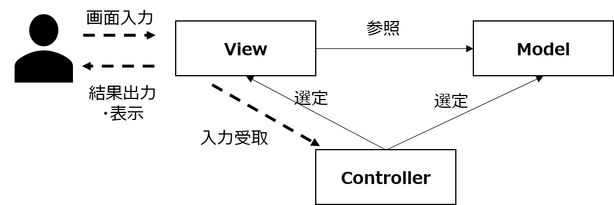
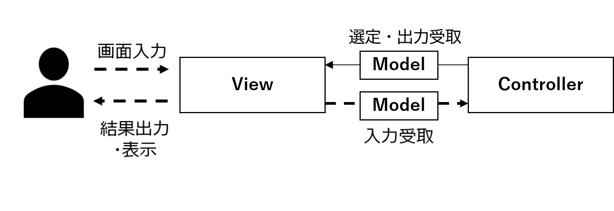
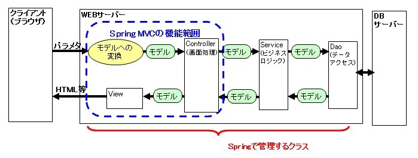
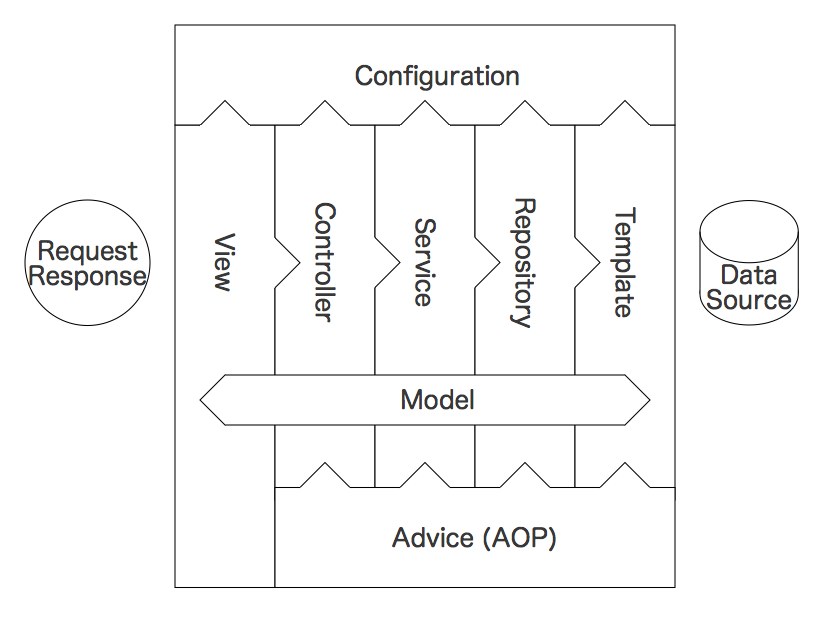

# はじめに
本稿では**Spring Frameworkが捉えるWEBアプリの構造を基準に**WEBアプリの大まかな全体構造と、その中の一部であるSpringMVCという構造について説明していく。**あくまでいくつかの記事を参考にまとめた個人の見解**なので、**内容に間違いや不足の可能性がある**ことは留意していただきたい。**ていうか指摘してほしい。**

# そもそもMVCとは？
SpringMVCの前にそもそもMVCとは何かに軽く触れておく。(MVCとSpringMVCはちょっと違うよていう話がしたい。)
MVCとはUIを持つアプリケーションを**Model**/**View**/**Controller**の3つの役割に分けた設計思想のこと。
それぞれの役割は以下の通り。

- **Model**: 処理担当
- **View**： UI担当(ユーザからの画面入力/ユーザへの結果出力)
- **Controller**：制御担当(入力情報をもとにどのModelに処理をさせるか、結果をどのViewに出力させるかを決める)

流れとしては以下の1~5を繰り返す。
1. ユーザからの入力をViewが受け取り、Controllerに渡す。
2. Controllerは入力に応じてどのModelに処理をさせるか選択し、Modelに入力を渡して処理させる。
3. Modelは処理を行い、結果をControllerに渡す。
4. Controllerは結果に応じてどのViewに表示させるか選択する。
5. ViewがModelから結果を参照して表示する。

# SpringMVCとは ～MVCと何が違う？～
SpringMVCのM・V・CはMVCのときと同じくModel・View・Controllerを指す。ただし、**それぞれの役割が異なる。特にModel**。

- **Model**: **View⇔Controller間でやり取りするデータ**
- **View**： UI担当(ユーザからの画面入力/ユーザへの結果出力)
- **Controller**：制御担当(入力データ受取とViewの選択と出力データ引き渡し)

上記の図からもわかる通り、**SpringMVCにおけるModelはただのデータを保持するための入れ物(POJO)**であり**MVCにあった処理担当が存在しない**。実は**SpringMVCはWEBアプリを構成する構造の一部**であり、SpringMVCだけではWEBアプリの機能を完結させることができない。

###### ※このMVCとSpringMVCではModelの意味が異なるために、Modelという言葉は「処理担当」「処理を持たないただの入れ物(POJO)」の両極端な意味で扱われる迷惑な言葉になってしまってる（と思う）。

# WEBアプリの全体構造 ～SpringMVCの役割～
以下の図を見ると

# Springが捉えるWEBアプリの全体構造
次にSpring Frameworkにおける(Web)アプリケーションの全体構造を見ていく。Spring Frameworkでは以下のようなコンポーネント(部品)で全体が構成されている。各コンポーネントには対応するアノテーションが存在し、これらの**アノテーションをクラスに付与することで、ユーザから、そしてDIコンテナからもそのクラスがどのコンポーネントとしての役割を持つのか一目で分かる**ようになっている。  

各コンポーネントが持つ役割(責務ていう方が一般的なのかも)は以下の通り。

| コンポーネント | 対応アノテーション | 役割 |
|:-:|:-:|:-:|
| Model | - | 各コンポーネント間でデータをやりとりするためのコンポーネント。POJO(処理を持たないただの入れ物としてのデータ)にするのが一般的。 |
| View | - | フロントにレスポンスされるもの。HTML,JSON,XML,CSV,PDFなどJavaでない部分が担うので対応アノテーションはない。 |
| Controller | @Controller | フロントからのリクエスト、およびフロントへのレスポンスのハンドリングのみを行い、具体的な処理は別のコンポーネントに任せる。 |
| Service | @Service | 処理担当の主役。レスポンス、リクエストに依存したような処理やDBとの直接的なやり取りは担当外。 |
| Repository | @Repository | DBとのやり取り担当。 |
| Template | - | よくわからん。後で調べよう。 |
| Configuration | @Configuration | 構成管理や設定担当。 |
| Advice | @Aspect @ControllerAdvice |  |
| - | @Component |  |

ここで注意してほしいことは**MVCとSpringMVCではModelの役割が異なる**こと。

# SpringMVCの役割

# 参考
Spring MVC 基本概念  
https://sites.google.com/site/soracane/home/springnitsuite/spring-mvc/1-ji-ben-gai-nian-quan-ti-dena-chu-lifuro

Spring での責務についてまず見てほしい一枚の絵  
https://qiita.com/yo1000/items/a6acbf5f454a7f53aef9

MVC とは何かを 1 から学ぶ  
https://qiita.com/tentom/items/de95f63bc9e2da2bd0bf
