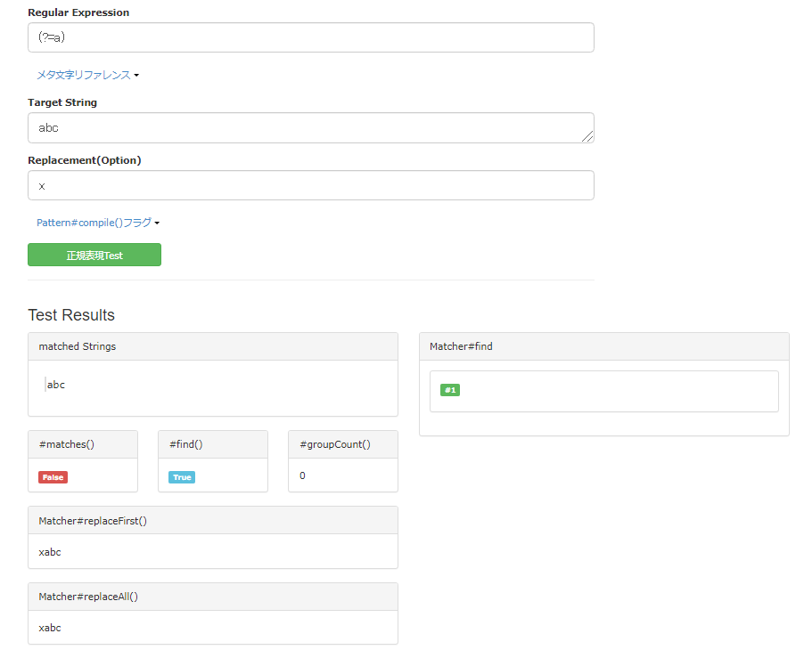
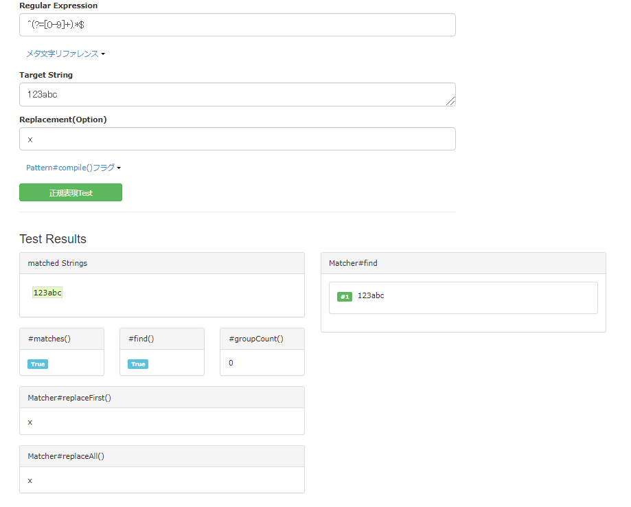
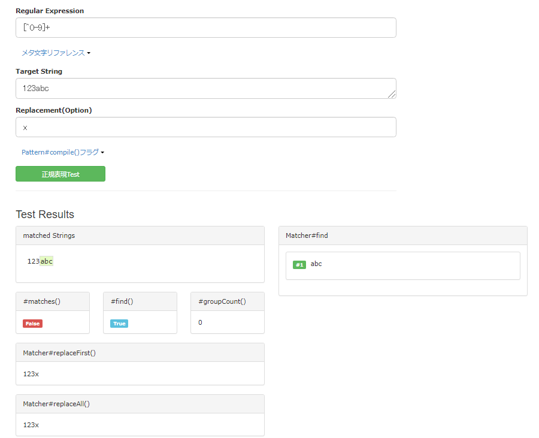
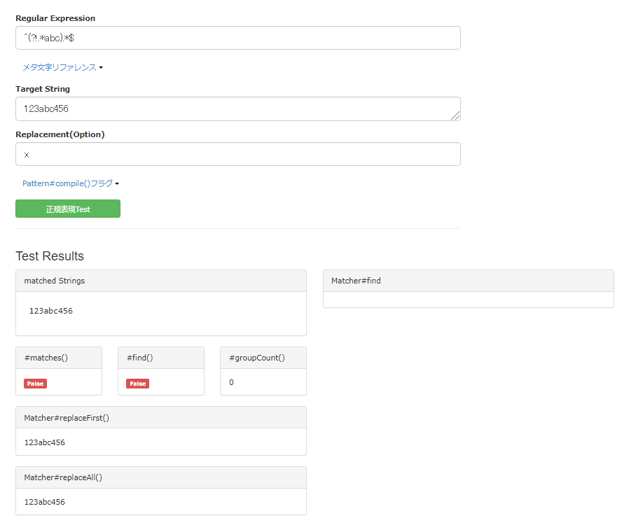
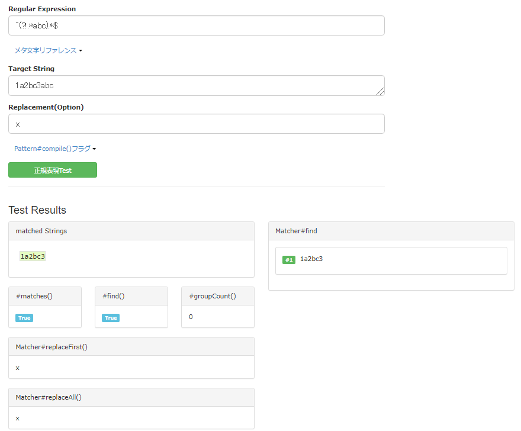
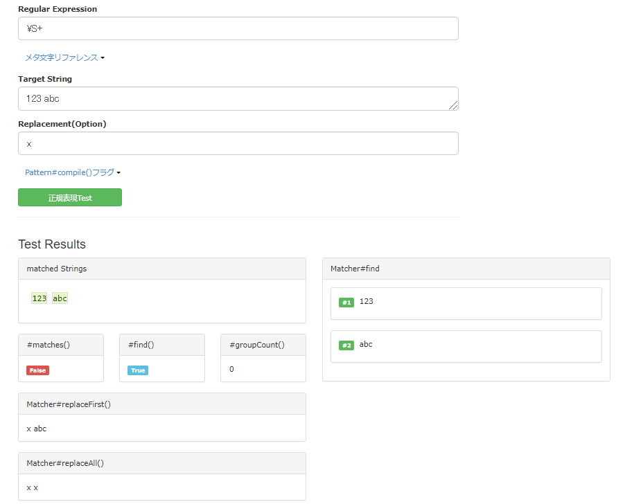

## 肯定先読み/肯定後読み/否定先読み/否定後読み とは
いちばんわかりやすい肯定先読みを中心に説明する。  
これが理解できればほかのも同じ考え方で理解できると思う。

**肯定先読み**は以下のように書き、**パターンに合致する文字列の先頭位置の空文字**にマッチする。  
```
(?=パターン)
```
パターンに合致する文字列そのものではなく、位置にマッチする点がほかの記述方法と異なる特徴である。

#### 例
- 「a」に合致する文字列の先頭位置
```
(?=a)
```
Javaのreplace()やreplaceAll()を使うとaの先頭位置の空文字が置換される。


このように肯定先読みを使えば、replace()を使って**特定の位置に文字列を挿入**することができる。

- 数字で始まる文字列 （「^[0-9]+.*$」の書き換え）
```
^(?=[0-9]).*$
```

このように(?=)内にはパターンを入力することもできる。


ちなみに肯定先読み以外の**肯定後読み**,**否定先読み**,**否定後読み**の書き方は以下の通り。  
- 肯定後読み
```
(?<=パターン)
```
- 否定先読み
```
(?!パターン)
```
- 否定後読み
```
(?<=パターン)
```
それぞれ**パターンに合致するもの(肯定)か合致しないもの(否定)**、**先頭位置(先読み)か末尾位置(後読み)か**の違いがあるだけで、考え方は同じ。

## 否定先読み/否定後読みを使った「～でない文字列」のパターンマッチング
上記例のようにパターンに合致する文字列であれば、肯定先読み/後読みでなくても記述可能だったが、パターンに合致しない文字列をマッチングするには否定先読み/後読みの書き方が役立つ。

- 「abc」を含まない文字列
```
^(?!.*abc).*$
```


ちなみにパターンではなく、特定の一文字を含まない文字列であれば、以下のように **「否定の文字クラス」** や **エスケープシーケンス(\)** を使って書くこともできる。
- 数字を含まない文字列（否定の文字クラス「[^文字]」）
```
[^0-9]+
```



- 空白文字を含まない文字列（エスケープシーケンス 「\」）  
「\s」(小文字)で空白、「\S」(大文字)で空白でない文字になる。
```
\S+
```


## 参考
正規表現 先読みと後読みを使ったパターン  
https://www.javadrive.jp/regex-basic/writing/index2.html

正規表現チェックツール(Java)  
https://regex-testdrive.com/ja/dotest

